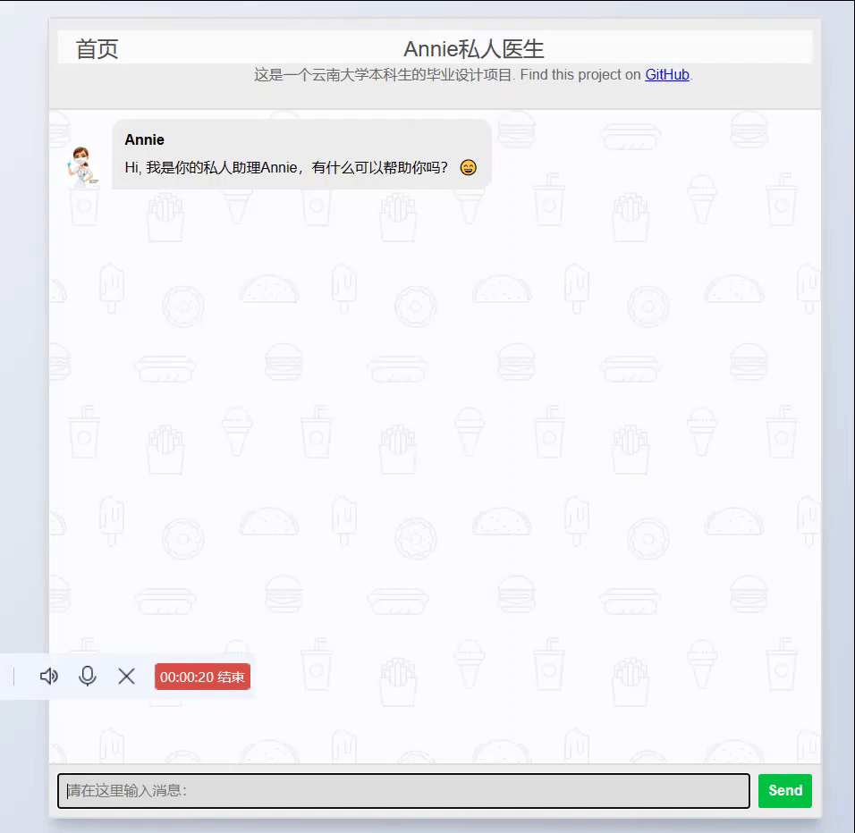
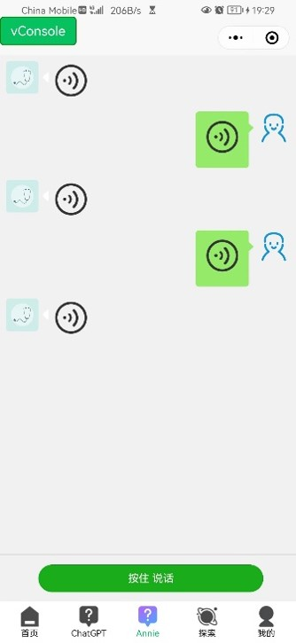

# Medical_ChatBot
## 项目名称

基于知识图谱的医疗健康问答系统  [Github](https://github.com/loveleaves/Medical_ChatBot) 

## 项目介绍

> 功能：本系统能实现常见疾病相关的文本和语音问答。
>
> 构成：本项目V2.x共包含四个部分，分别为问答系统的Web前端、小程序前端、服务后端和小程序后台管理前端。

### 设计思路

本系统基于KBQA（基于知识图谱的问答）和TODS（任务型对话系统）实现的基于深度学习的、检索式的、任务型导向的问答系统。

### 项目效果

#### web前端

#### 小程序前端

### 目录结构

### 部署教程

## 开源协议

Medical_ChatBot采用MIT license，详情见[MIT LICENSE](./LICENSE)。